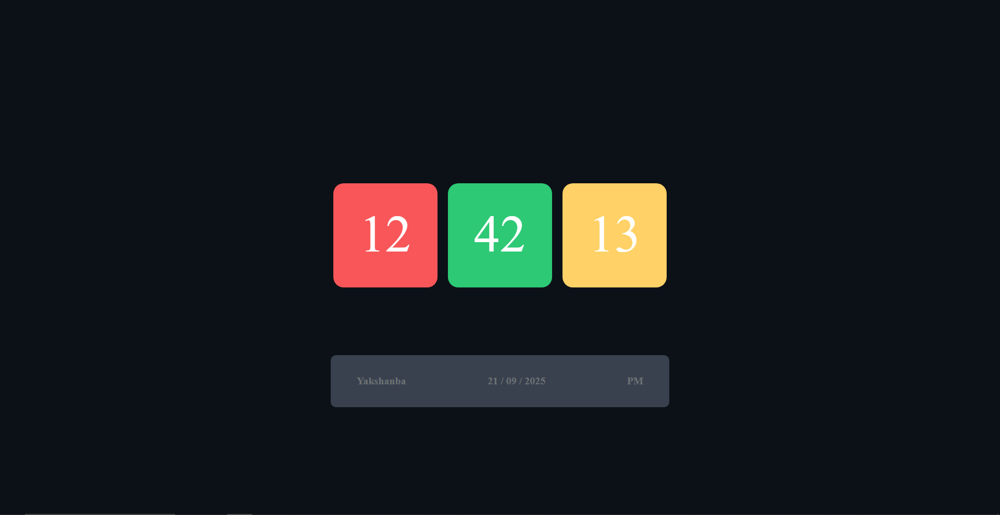

# 🕒 ClockTab  

  

> *“Time is money… lekin bu app bepul 😅”*  

---

## 📖 Table of Contents  
- [🌍 English Version](#-english-version)  
- [🇺🇿 O‘zbekcha Versiya](#-o‘zbekcha-versiya)  

---

## 🌍 English Version  

### 📖 What is this project?  
**ClockTab** is a lightweight and simple **clock tab widget** built with **HTML, CSS, and JavaScript**.  
It shows the **real-time clock** when you open it in your browser — perfect for a clean and minimalistic setup.  

### ✨ Features  
- 🕓 Real-time clock (hours, minutes, seconds)  
- 🎨 Clean and stylish design  
- 📐 Responsive — works on different screen sizes  
- ⚡ Super lightweight (no dependencies)  
- 🌙 Future option for Light/Dark mode  

### 🛠️ Tech Stack  
- **HTML5** — page structure  
- **CSS3** — styling & layout  
- **JavaScript (ES6)** — clock logic & updates  

### 🚀 How to run?  
```bash
# 1. Clone the repository
git clone https://github.com/AzicoUz/ClockTab.git

# 2. Go into the folder
cd ClockTab

# 3. Open index.html in your browser
```

### 📂 Project Structure  
```
ClockTab/
│── index.html         # Main file
│── css/
│   └── style.css      # Styles
│── js/
│   └── script.js      # Clock logic
│── screenshot.png     # Preview screenshot
└── README.md
```

### 🌱 Roadmap  
- 🌑 Add Light/Dark mode toggle  
- 📅 Show date & weekday  
- 🔔 Alarm feature  
- ✨ Add smooth animations  

### 🤝 Contributing  
1. Fork the repo 🍴  
2. Create a feature branch (`git checkout -b feature/awesome-feature`)  
3. Commit your changes (`git commit -m 'Added awesome feature'`)  
4. Push to the branch (`git push origin feature/awesome-feature`)  
5. Open a Pull Request 🚀  

### 📜 License  
Distributed under the **MIT License**.  

---

## 🇺🇿 O‘zbekcha Versiya  

### 📖 Bu loyiha nima?  
**ClockTab** — bu oddiy va engil **soat vidjeti** bo‘lib, **HTML, CSS va JavaScript** yordamida yozilgan.  
Brauzeringizda ochgan zahoti **real vaqt soati**ni ko‘rsatadi — minimalistik dizayn ixlosmandlari uchun ajoyib.  

### ✨ Xususiyatlari  
- 🕓 Real vaqt (soat, daqiqa, sekund)  
- 🎨 Chiroyli va sodda dizayn  
- 📐 Responsiv — turli ekranlarda moslashuvchan  
- ⚡ Juda yengil (hech qanday kutubxona yo‘q)  
- 🌙 Keyingi bosqichda Light/Dark mode qo‘shilishi mumkin  

### 🛠️ Ishlatilgan texnologiyalar  
- **HTML5** — sahifa tuzilishi  
- **CSS3** — dizayn va joylashuv  
- **JavaScript (ES6)** — soat logikasi va yangilanishi  

### 🚀 Qanday ishga tushirish kerak?  
```bash
# 1. Reponi klon qiling
git clone https://github.com/AzicoUz/ClockTab.git

# 2. Papkaga kiring
cd ClockTab

# 3. index.html faylini brauzerda oching
```

### 📂 Loyiha tuzilishi  
```
ClockTab/
│── index.html         # Asosiy fayl
│── css/
│   └── style.css      # Stil fayli
│── js/
│   └── script.js      # Soat logikasi
│── screenshot.png     # Preview rasmi
└── README.md
```

### 🌱 Reja  
- 🌑 Light/Dark mode qo‘shish  
- 📅 Sana va hafta kunini ko‘rsatish  
- 🔔 Signal (alarm) funksiyasi  
- ✨ Yumshoq animatsiyalar qo‘shish  

### 🤝 Hissa qo‘shish  
1. Repo’ni fork qiling 🍴  
2. Yangi branch yarating: `git checkout -b feature/awesome-feature`  
3. O‘zgarishlarni commit qiling: `git commit -m 'Added awesome feature'`  
4. Branchni push qiling: `git push origin feature/awesome-feature`  
5. Pull Request oching 🚀  

### 📜 Litsenziya  
Bu loyiha **MIT License** ostida tarqatiladi.  

---
